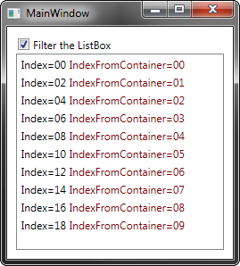

# IndexFromContainerSample

A simple sample to demonstrate ItemContainerGenerator.IndexFromContainer

Main question: "How can I get the real index from a container in a filtered ListBox with ItemContainerGenerator.IndexFromContainer(searchitem)?"

